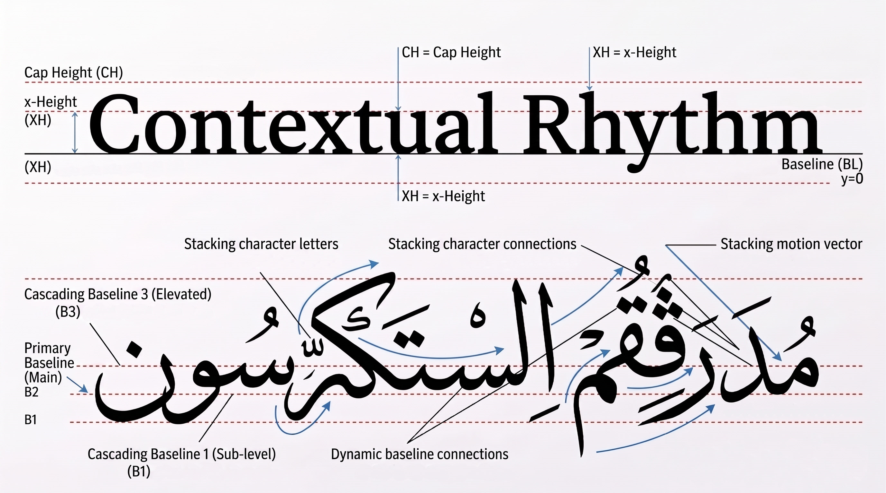

# Font Metrological Analyzer & Cascading Baselines Study

A metrological and anatomical study examining the vertical metrics, coordinate spaces, and baseline dynamics of **IBM Plex Sans** (Latin) and **IBM Plex Sans Arabic**, supported by automated `FontTools` extraction and structural typography analysis.

---

## Visual Rhythm & Structural Anatomy

This comparative analysis demonstrates the fundamental architectural divergence between the rigid horizontal Latin baseline ($y=0$) and the dynamic, multi-tiered cascading baseline system inherent to Arabic cursive calligraphy (based on Thomas Milo's DecoType research).

### Key Structural Baselines:
- **$B_3$ — Cascading Baseline 3 (Elevated):** Elevated secondary baseline accommodating ascending glyph bodies, nested kafs (`ك`), and stacked character connections.
- **$B_2$ — Primary Baseline (Main):** Main sitting baseline establishing line-level horizontal visual coherence.
- **$B_1$ — Cascading Baseline 1 (Sub-level):** Deep landing baseline accommodating descender bowls (Nun, Ra, Qaf) and low ligature connections.
- **Dynamic Baseline Connections:** Multi-tier fluid transit links bridging cascading letters across running words.

---

## Comparative OpenType Metrology

Extracted using `extract_metrics.py` via `fontTools`:

| OpenType Metric | Latin (`IBM Plex Sans`) | Arabic (`IBM Plex Sans Arabic`) | Geometric & Typographic Significance |
| :--- | :---: | :---: | :--- |
| **Coordinate Space** (`unitsPerEm`) | `1000` | `1000` | Shared design coordinate space across both scripts within the digital font binary, unifying relative glyph scaling. |
| **Mac Ascender** (`hhea.ascender`) | `1025` | `1085` | Line ascent metric across Apple/WebKit environments; calibrated to prevent inter-script line clipping in Safari. |
| **Mac Descender** (`hhea.descender`) | `-275` | `-415` | Line descent metric allocated to accommodate deep sub-baseline bowls and descending ligatures. |
| **Mac Line Gap** (`hhea.lineGap`) | `0` | `0` | Setting `lineGap` to zero prevents digital rendering engines from introducing arbitrary, unstandardized vertical padding. |
| **Typo Metrics Flag** (`fsSelection` bit 7) | `Enabled (1)` | `Enabled (1)` | Activates `USE_TYPO_METRICS`, forcing modern layout engines to prioritize `sTypo` values over legacy `usWin` clipping bounds. |
| **Typographical Ascender** (`sTypoAscender`) | `1025` | `1085` | Extended in Arabic to provide overhead vertical clearance for multi-tiered diacritical marks (tashkeel) and hamzas. |
| **Typographical Descender** (`sTypoDescender`) | `-275` | `-415` | Deeper allocation in Arabic accommodating sub-baseline terminals (Nun, Ra, Qaf) and lower diacritical signs (kasra). |
| **Typographical Line Gap** (`sTypoLineGap`) | `0` | `0` | Zeroed typographic line gap ensures strict, predictable line budgeting directly governed by explicit ascender and descender boundaries. |
| **Total Typo Budget** (`Typo Total`) | `1300` | `1500` | Net line budget (`sTypoAscender - sTypoDescender + sTypoLineGap`); provides Arabic with a larger vertical envelope to absorb cascading glyph stacking. |
| **Windows Safe Ascent** (`usWinAscent`) | `1120` | `1128` | Windows GDI top clipping limit expanded to prevent visual clipping of compound mark-to-mark (`mkmk`) diacritics. |
| **Windows Safe Descent** (`usWinDescent`) | `275` | `601` | Safe bottom clipping margin increased significantly (+118.5%) to protect low diacritical marks, bottom dots, and punctuation. |
| **Lowercase Height** (`sxHeight`) | `515` | `Undefined / Nominal` | Purely Latin structural reference; artificially forcing Arabic medial teeth onto a rigid x-height flattens its calligraphic rhythm. |
| **Cap Height** (`sCapHeight`) | `698` | `698 (Reference)` | Restrains vertical ascenders of Alef and Lam to maintain visual and optical parity with Latin uppercase letters in bilingual text. |

---

## Installation & Setup

### Prerequisites
- Python 3.8+
- `pip` package manager